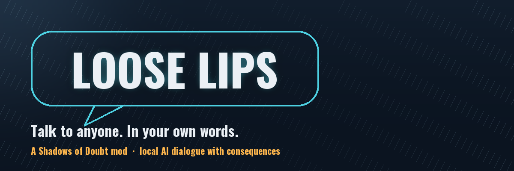

<p align="center">
  
</p>

<p align="center">
  <b>Talk to anyone in Shadows of Doubt in your own words. Or shout at them. Or whisper.</b><br>
  A local AI answers in character — and what it says changes the world.
</p>

---

Ask a barman what he saw. Lie about being a police officer and watch the street scatter.
Lean in and whisper so only one person hears. Talk somebody into handing over the cash in
their pocket, into telling you where they saw your suspect, into walking away — or into
taking your side when the shooting starts.

Nothing here is a menu. You type what you want to say, and a citizen who has their own
personality, job, grudges and secrets decides what to do about it.

## What makes it different from a chatbot

**The model proposes, the game disposes.** Every consequence is checked against real game
state before it happens. A citizen cannot hand you an item they are not carrying, cannot
summon police when no officer is in earshot, and cannot shift a relationship further than the
mod allows in one sentence. When the AI asks for something impossible, it is refused — with
the reason written to a log you can read.

So the worst case is a citizen who talks a big game and does nothing. Never a citizen who
invents a key out of thin air.

---

# Installing

## What you need first

| | |
|---|---|
| **Shadows of Doubt** | The game itself |
| **[Player2](https://player2.game/)** | A free desktop app that runs the AI. **Install it, open it, and sign in** — the mod talks to it on your own machine |
| **BepInEx 6 (IL2CPP)** | The mod loader. The Thunderstore installer below sets this up for you |

> **The Player2 app must be running while you play.** If it is closed, citizens fall back to
> the game's normal dialogue and the mod tells you so.

## The easy way — Thunderstore Mod Manager

1. Install **[Thunderstore Mod Manager](https://www.overwolf.com/app/Thunderstore-Thunderstore_Mod_Manager)** and pick Shadows of Doubt
2. Search for **Loose Lips** and click Install
3. Click **Start modded**

That is it. BepInEx and everything else comes along automatically.

## The manual way

1. Install BepInEx 6 bleeding-edge (IL2CPP) into your Shadows of Doubt folder
2. Download the latest release from the [Releases page](../../releases)
3. Unzip it so you get `BepInEx/plugins/LooseLips/LooseLips.dll`
4. Start the game

# First five minutes

1. Start the game with the **Player2 app already open**
2. Press **F4**. The mod's window appears — the Connection tab should say **Connected**
   (press *Test connection* if you are unsure)
3. Close it, walk up to anybody, and talk to them
4. At the **top** of the dialogue list you will see two new options:

   - **Say something…** — normal speech, heard by people nearby
   - **Shout something…** — carries much further, including into the next room

5. Type a line, press **Enter**

The first reply takes a few seconds — the AI is thinking. The citizen shows a beat while it
does, and the game keeps running.

# What you can actually do

Convince, threaten, lie, flatter, bribe. Depending on who they are and how they feel about
you, a citizen can:

- **Tell you what they know** — or be vague, or lie outright, depending on their personality
  and whether the truth hurts them or somebody they care about
- **Give up where and when they saw somebody** — this arrives as a real lead in your case
  file, through the game's own witness system
- **Hand over what they are carrying** — the item in their hand, or cash in their pocket
- **Name a price** for what they know, and take your money when you agree
- **Call the police on you**, off you, or onto somebody else standing there
- **Run, fight, surrender, or come with you**
- **Take your side** — and step in when somebody attacks you
- **Go home, go to work, or clear off**

Shout, and it lands on everyone in earshot instead of one person: a street can be made to
scatter, settle, or come running to look.

Optionally, citizens also **talk to each other** while you listen in, and **react out loud**
to what happens around them — a fight, a fright, somebody bolting. Both are **off by default**
because each line costs a few seconds of AI time.

# Settings (F4)

| Tab | What is in it |
|---|---|
| **Connection** | The Player2 app, which model, credits remaining |
| **Talking** | Memory, how far your voice carries, whispering, background chatter |
| **Consequences** | Exactly what a conversation is allowed to do to the world — every one can be switched off |
| **Appearance** | Window size, opacity, theme |
| **Debug** | A self-test that walks the whole chain and names what fails, plus the transcript |

Everything can be changed while playing.

# If something is not working

| What you see | What it means |
|---|---|
| "Not detected" in the Connection tab | The Player2 app is not running, or not signed in. Open it and press *Test connection* |
| "Out of Player2 credits" | Your Player2 balance ran out. It refills over time; background chatter pauses first so your own conversations keep working |
| Citizens talk but never *do* anything | Check the Consequences tab — world effects may be switched off |
| Replies take a long time | Normal on a busy machine. Lower *Remembered turns per person* in the Talking tab to make each exchange cheaper |
| No new dialogue options | Check the BepInEx console for `Loose Lips … loading`. Another mod throwing an error early can stop later mods from finishing setup |

**The transcript is the best debugging tool.** Every exchange is written to
`BepInEx/LooseLips-transcript.log`: what was said, how long the AI took, what it asked to do,
and — importantly — **what the game refused and why**. If a conversation feels wrong, the
answer is usually in there.

# A note on Player2 credits

Generation is not free, though it is cheap: an exchange costs roughly a third of a Player2
credit, and the balance refills over time. On a free account that still adds up, so the mod
keeps a reserve — background chatter stops before your own conversations do, and the
Connection tab shows what is left.

The mod identifies itself to Player2 as `loose-lips`. Player2 uses that to attribute time
spent and pays a share of their revenue back to mod authors, so please leave it alone unless
you are building your own fork.

# Support the mod

Loose Lips is free and always will be. If it made your city more alive and you would like to
throw something in the hat:

**[💵 Donate via PayPal](https://www.paypal.com/donate/?hosted_button_id=UQW23PY9YRUAQ)** &nbsp;·&nbsp;
**[☕ Buy me a coffee on Ko-fi](https://ko-fi.com/hubertkenobi)**

Entirely optional. Bug reports and pull requests are worth just as much.

# For modders

MIT licensed — fork it, change it, ship your own version. Adding a new thing a conversation
can do is deliberately one entry in a catalogue; see [CLAUDE.md](CLAUDE.md) for the design
rules and the environment gotchas that cost the most time.

```bash
dotnet build -c IL2CPP          # build the mod
cd tests && dotnet run          # 25 checks, no game needed
python assets/make_images.py    # regenerate the artwork
```

# Credits

Built by **Hubert Dungen**. Dialogue generated by the [Player2](https://player2.game/) app.
Shadows of Doubt is by ColePowered Games; this is an unofficial fan project.
